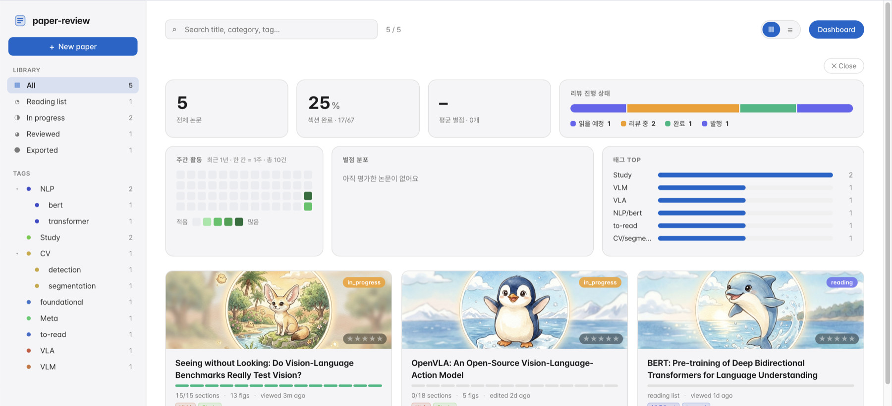
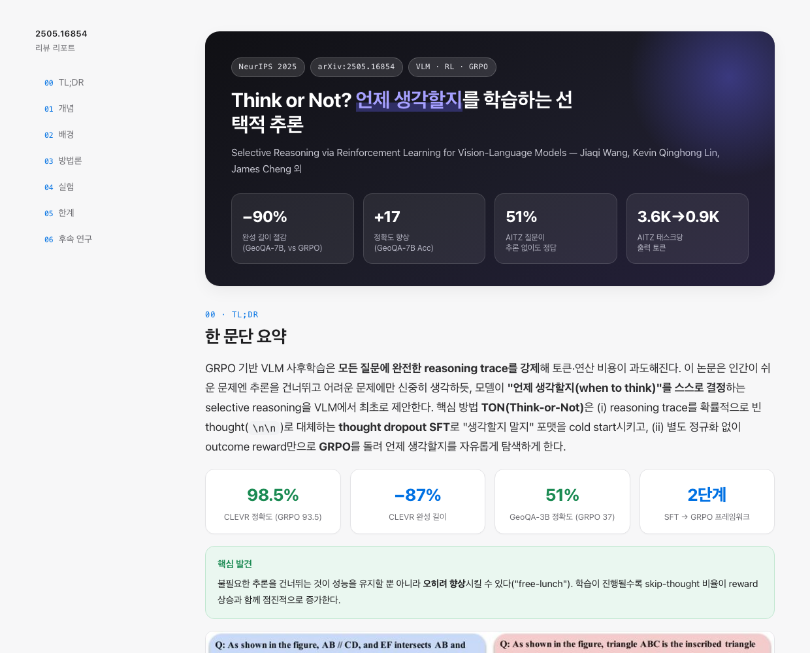
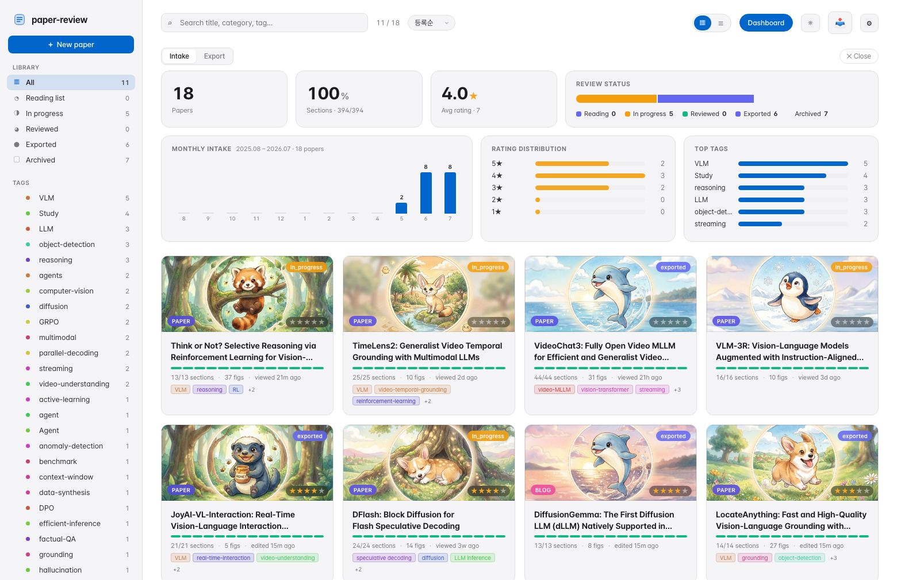
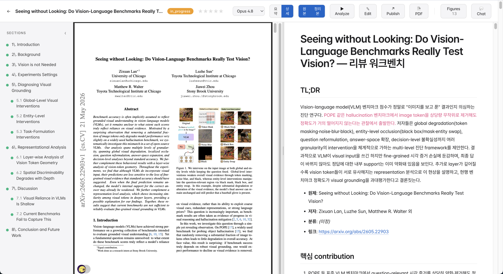

<div align="center">

# 📄 paper-review

**Read papers *with* Claude — not just summaries.**

Ingest an arXiv paper, engineering blog, or any web article → review it section by section together with Claude → turn the finished review into a structured report and a publish-ready blog draft. Everything runs on your own machine.

[](https://github.com/Go-MinSeong/paper-review-service/releases)
[](https://github.com/Go-MinSeong/paper-review-service/releases)
[](https://github.com/Go-MinSeong/paper-review-service/stargazers)
[](https://www.python.org/)
[](https://claude.com/claude-code)
[](#-install)

[Install](#-install) · [How it works](#-how-it-works) · [Features](#-features) · [FAQ](#-faq) · [CHANGELOG](./CHANGELOG.md) · [DESIGN](./DESIGN.md)



</div>

---

## Why

Asking an LLM to "summarize this paper" gives you something you forget by tomorrow. Reading the whole paper alone is slow and easy to abandon halfway.

paper-review sits in between: it writes a **dense Korean explanation of every section** (numbers, symbols and comparisons intact), asks you probing questions, and keeps *your* notes as the primary content. When you're done it produces a **structured report** you can hand to your team — and a blog draft in your own voice.

```
arXiv / PDF / any URL ──► ingest ──► analyze ──► review with Claude ──► report ──► publish
                          (~1 min)   (~10 min)     (interactive)       (1 click)  (1 click)
```

## ✨ Features

| | |
|---|---|
| 📥 **Ingest anything** | arXiv link/ID, local PDF, or any web URL. The type is auto-detected (paper / engineering blog / web article) and each gets its own review rubric. Text, section index and figures (incl. SVG) are extracted for you. |
| 🤖 **Section-by-section analysis** | Headless Claude Code writes one **핵심 해설** block per section — source order preserved, filler compressed, every number and symbol kept. Resumable, cancellable, retries only the sections that failed. |
| 💬 **Review, don't skim** | A chat dock runs `claude -p` inside the paper's folder. Ask, challenge, record — `workbench.md` is the single source of truth and the page updates live over SSE. |
| 📊 **Structured report** | Every analyze run ends by turning the review into a self-contained HTML report (regenerate any time): `00 TL;DR → 01 개념 → 02 배경 → 03 방법론 → 04 실험 → 05 한계 → 06 후속 연구`, with key figures, result bars, an ⚠️/🔍 limitation split and web-searched follow-up papers. |
| 📝 **Publish** | Export the full review, the report, or both as [Velog](https://velog.io)/Obsidian drafts — figures materialized into your vault, your voice preserved. |
| 📱 **Continue on your phone** | Push one paper to a tiny Vercel slot, read and edit sections on mobile, pull the edits back. Manual sync, no account, one shared token. |
| 🏷️ **A library that scales** | Hierarchical tags (`CV/segmentation`), star ratings, a status workflow (Reading → In progress → Reviewed → Exported → Archived), search, grid/list views, per-paper illustrations. |
| 📈 **Dashboards** | Monthly **Intake** and **Export** views — throughput, median days from intake to export, status funnel, rating distribution, top tags. |
| 🎨 **Themes** | Light/dark plus Stripe · Figma · Tesla · Sunset · Sage, applied across the gallery, review page and source viewer. |
| 🖥️ **Runs like an app** | macOS menubar + double-clickable launcher, pretty local URL `http://paper-review.local/`, per-pane fullscreen, PDF export of whatever is on screen. |

<div align="center">


<br>
<sub><b>Left</b> — generated report (00–06, key numbers, paper figures). &nbsp; <b>Right</b> — monthly Intake / Export dashboards.</sub>
<br><br>

<sub>Review page — original PDF and workbench side by side, resizable, each pane toggleable and fullscreen-able.</sub>
</div>

## 🚀 Install

> **Requirements** — macOS for the menubar app and launcher (the server itself runs anywhere Python does), Python 3.10+, and the [**Claude Code CLI**](https://claude.com/claude-code) signed in (`claude auth login`). Ingest, browsing and publish work without it; analysis and chat need it.

### Option A — download the app (no terminal)

1. Grab `paper-review-<arch>.zip` from the [latest release](https://github.com/Go-MinSeong/paper-review-service/releases) and unzip it.
2. Right-click **paper-review.app** → **Open** (it is ad-hoc signed, so the first launch needs this).

### Option B — from source

```bash
git clone https://github.com/Go-MinSeong/paper-review-service
cd paper-review-service
uv venv && uv pip install -e .        # or: python -m venv .venv && .venv/bin/pip install -e .
bash install-skills.sh                # link the review skills into ~/.claude/skills/
.venv/bin/paper-review serve          # → http://127.0.0.1:7300  (also http://paper-review.local/)
```

Optional extras:

```bash
bash install-launcher.sh --apps       # double-clickable launcher in ~/Applications
bash install-menubar.sh               # menubar app that starts the server at login
bash packaging/build.sh               # build your own .app + zip
```

Not a terminal person? Download the ZIP of this repo and double-click **`setup.command`** — it installs `uv`, sets up the environment, links the skills and builds the launcher.

### First run

```bash
paper-review init 2505.16854          # or paste any link in the UI: + New paper
```

Open the gallery, click the card, hit **Analyze**, then review. Your library lives in this checkout — one gitignored folder per paper — and `PAPER_REVIEWS_ROOT=/path/to/library` moves it anywhere. Publish output goes to the folder set in **Settings → 경로** (default `~/Documents/velog-vault/drafts`).

## 🧭 How it works

```
                  ┌──────────────────── your machine ────────────────────┐
arXiv / PDF / URL │                                                      │
       │          │   FastAPI ──── gallery ──── review page (live SSE)   │
       ▼          │      │                          │                    │
    ingest ───────┼──►  <slug>/workbench.md ◄───────┘                    │
 (text, sections, │      │            ▲                                  │
  figures)        │      │            └── claude -p  (analyze · chat)     │
                  │      ▼                                               │
                  │  report.html / report.md ──► publish ────────────────┼──► Velog / Obsidian vault
                  └──────────────────────────────────────────────────────┘
```

- **`workbench.md` is the product.** Plain markdown per paper: TL;DR, prerequisite cards, one 해설 block per section, Q&A, wrap-up. Edit it in the browser (WYSIWYG), in your editor, or on your phone.
- **Claude Code writes, you review.** Every analysis prompt enforces scope discipline — what the paper claims vs. general inference, and "논문에 명시되지 않음" when there is no evidence.
- **Skills define the rubric.** `paper-review`, `blog-review` and `article-review` live in [`skills/`](./skills/) and are symlinked into `~/.claude/skills/`, so editing them (or **Settings → 스킬**) changes how reviews get written.

| Content type | Examples | Review skill |
|---|---|---|
| `paper` | arXiv / PDF | `paper-review` |
| `blog` | vLLM, PyTorch, company engineering & release posts | `blog-review` |
| `article` | news, op-eds, product / tech reviews, general web pages | `article-review` |

<details>
<summary><b>CLI reference</b></summary>

```bash
paper-review serve                     # web UI (default port 7300)
paper-review menubar                   # macOS menubar app
paper-review init <arxiv-id|pdf|url>   # ingest
paper-review list                      # papers + status
paper-review export-draft <slug>       # workbench → publish draft
paper-review remote push <slug>        # send one paper to the mobile slot
paper-review remote pull               # bring mobile edits back
```

Everything else — registering, analyzing, tagging, reviewing, reporting, publishing — happens in the browser.
</details>

<details>
<summary><b>Repo layout</b></summary>

| Path | Role |
|---|---|
| `src/paper_review/cli.py` | command entry points |
| `src/paper_review/server/` | FastAPI routes + gallery/detail UI (HTML/CSS/JS) |
| `src/paper_review/server/{ingest,analyze,chat,save,tags}.py` | background jobs + endpoints |
| `src/paper_review/publish/` | workbench → draft (parser + transform) |
| `src/paper_review/_paper_reader/` | vendored ingest engine (text, figures, viewer) |
| `src/paper_review/menubar.py` | macOS menubar app (rumps) |
| `remote/` | optional Vercel app for mobile continuation |
| `skills/` | the review skills (source of truth) |

Per-paper state lives in `<repo>/<slug>/`: `workbench.md`, `paper.json`, `source.txt`, `report.html`, figures, original PDF — all gitignored. See [`DESIGN.md`](./DESIGN.md) for the rationale and locked decisions.
</details>

## ❓ FAQ

<details>
<summary><b>Do I need a paid Claude plan?</b></summary>

You need the Claude Code CLI signed in — a Claude subscription or API access both work. Analysis spawns `claude -p` per section, so cost scales with paper length; pick a cheaper model from the topbar picker (Opus 5 / Opus 4.8 / Sonnet 5 / Fable 5 / Haiku 4.5) when you just want a fast pass.
</details>

<details>
<summary><b>Is my data sent anywhere?</b></summary>

Papers, reviews and figures stay in your checkout. Outbound traffic is limited to Claude Code (analysis/chat), arXiv/web fetches at ingest, optional web search while generating a report, and — only if you set them up — your own Vercel slot for mobile and your vault at publish.
</details>

<details>
<summary><b>Is it Korean-only?</b></summary>

Review output is Korean by default (technical terms stay in English) because that is what the bundled skills prescribe. Edit the skills to change the language — the pipeline itself is language-agnostic.
</details>

<details>
<summary><b>Can I run it on Linux or Windows?</b></summary>

`paper-review serve` and the whole web UI work anywhere Python runs. The menubar app, the launcher and the `paper-review.local` pretty URL are macOS-only.
</details>

<details>
<summary><b>Where do I put my writing samples for publish?</b></summary>

`src/paper_review/publish/voice_samples/` (gitignored). Drop in 5–7 of your own posts and publish will match your tone; without them you still get the structural pass.
</details>

<details>
<summary><b>Card illustrations look repetitive.</b></summary>

The repo ships 6 original character sets (21 images). A card avoids reusing a character until every one has been used, so a large library repeats. Add your own in **Settings → 일러스트**.
</details>

<details>
<summary><b>Analysis failed with an authentication error.</b></summary>

Run `claude auth login` and press Analyze again — no server restart needed. The analyze log says exactly this when it detects an expired session.
</details>

## 🗺️ Roadmap

- [x] Papers, engineering blogs and web articles with per-type rubrics
- [x] Structured report + separate report/detail publishing
- [x] Mobile continuation (Vercel slot)
- [x] Monthly intake / export dashboards
- [ ] Multi-language review output out of the box
- [ ] Zotero / Notion import
- [ ] Linux/Windows tray app

## 🤝 Contributing

Issues and PRs are welcome — bug reports with the analyze log attached are especially useful. Keep `pytest -q` green (`uv pip install -e '.[dev]'`); Python is formatted with `black` (line length 88).

## 🙏 Acknowledgements

Built on [Claude Code](https://claude.com/claude-code). The report layout is adapted from a teammate's paper-review template; the publish flow targets [Velog](https://velog.io) through an Obsidian vault. Character illustrations bundled in this repo are original artwork.

<div align="center">
<sub>If this helps you actually finish papers, a ⭐ is appreciated.</sub>
</div>
